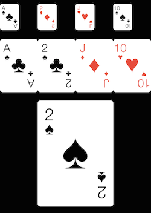

LCLPlayingCardView
===============

LCLPlayingCardView is a simple, but beautiful playing card implemented as a UIView.  
Available as a [CocoaPod](http://cocoapods.org). See [CocoaDocs documentation](http://cocoadocs.org/docsets/LCLPlayingCardView/1.0.1/Classes/LCLPlayingCardView.html) for more details.


###Features:

- Lightweight:  No images for the cards -- 100% code.
- Flexible: Since the cards are code, you can tweak anything about them to fit your needs.
- Realistic Feel:  The included customizations make the cards feel more real.
- Three pre-configured Sizes: Small, Medium and Large

##Getting Started
###Install with CocoaPods

[CocoaPods](http://cocoapods.org/) is a dependency manager for Objective-C, which automates and simplifies the process of using 3rd-party libraries in your projects.  In your Podfile, add the following:
```ios
platform :ios, '7.0'
pod "LCLPlayingCardView", "~> 2.0"
```

###Or Manually Import Headers
```ios
#import "LCLPlayingCardView.h"
```


##Usage
###Example Usage



Initialize Small Card:
```ios
    LCLPlayingCardView *card1 = [LCLPlayingCardView cardWithPoint:CGPointMake(80, 120)
                                                 withCardSize:LCLPlayingCardSmall
                                                     withRank:2
                                                     withSuit:LCLPlayingCardDiamond
                                                    isVisible:YES];
    [self.view addSubview:card1];
```

Initialize Medium Card:
```ios
    LCLPlayingCardView *card2 = [LCLPlayingCardView cardWithPoint:CGPointMake(80, 0)
                                                 withCardSize:LCLPlayingCardMedium
                                                     withRank:11
                                                    withSuit:LCLPlayingCardClub
                                                   isVisible:YES];
    [self.view addSubview:card2];
```

Initialize Large Card:
```ios
    LCLPlayingCardView *card3 = [LCLPlayingCardView cardWithPoint:CGPointMake(80, 200)
                                                     withCardSize:LCLPlayingCardLarge
                                                         withRank:10
                                                         withSuit:LCLPlayingCardSpade
                                                        isVisible:YES];
    [self.view addSubview:card3];
```

####Methods
```ios
- (void)flipCard;
- (void)tiltCardWithDegrees:(float)degrees
- (void)tiltCardRandomly
```

##License
LCLPlayingCardView is available under the MIT license.  See the LICENSE file for more information.  

If you like this or use this, please star/fork/watch/tweet the repo, raise issues/ideas, send me pull requests, etc. so I know to keep improving it.


##Change Log
####v2.0.0
- Add LCLPlayingCardSize enum for LCLPlayingCardViewSmall, LCLPlayingCardViewMedium and LCLPlayingCardViewLarge
- Tweak label sizes for Small and Large cards based on LCLPlayingCardSize
- Update example project with examples in each size
- Make most of the properties private
- Make suit & rank properties readonly
- Remove font size, card width and card height constants
- Deprecate cardwithFrame initialization

####v1.0.2
- Add example project
- Add LCLPlayingCardSuit enum
- Allow initialization of cardback color and text

##Future Improvements
- Externally manage back of card image vs solid color

